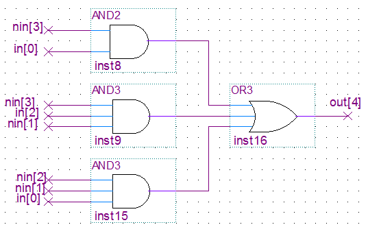
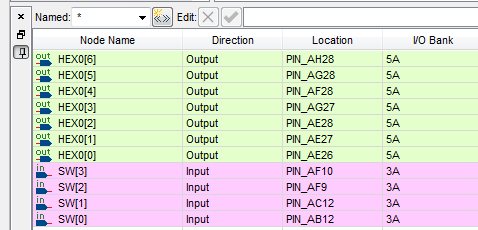
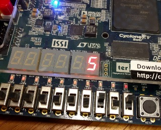

# Experiment 1: Schematic 7-segment display

### Paper design
Designing the boolean equation for out[4] by hand:

Digit | in   | out[4]
----- | ---- | ------
0     | 0000 | 0
1     | 0001 | 1
2     | 0010 | 0
3     | 0011 | 1
4     | 0100 | 1
5     | 0101 | 1
6     | 0110 | 0
7     | 0111 | 1
8     | 1000 | 0
9     | 1001 | 1
A     | 1010 | 0
B     | 1011 | 0
C     | 1100 | 0
D     | 1101 | 0
E     | 1110 | 0
F     | 1111 | 0

Simplifying it using a Karnaugh map:

AB/CD  | 00 | 01 | 11 | 10
-------|----|----|----|----
**00** | 0  | 1  | 1  | 0
**01** | 1  | 1  | 1  | 0
**11** | 0  | 0  | 0  | 0
**10** | 0  | 1  | 0  | 0

Gives us the following in SOP form:

`(A' D) + (B' C' D) + (A' B C')`

which, letting `NOT in` = `nin`, gives:

```
nin[3] && in[0]  ||  nin[2] && nin[1] && in[0]  ||  in[3] && in[2] && nin[1]
```

### Specifying out[4] in the schematic

Using my7seg_incomplete.bdf, we added the logic for out[4] in terms of AND and OR gates.



### Assigning pins

We assigned pins manually to `HEX[6..0]` and `SW[3..0]` using the Pin Planner.



### Testing the design

We compiled the project and programmed the DE1 board. It works!



### Propagation delays

We created two different report datasheets: `Slow 1100mV 0C Model` and `Slow 1100mV 85C Model`
