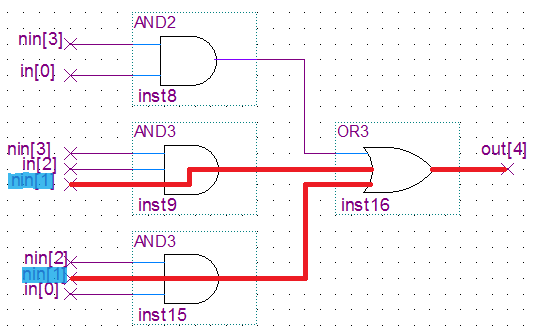

# Experiment 1: Schematic 7-segment display

### Paper design
Designing the boolean equation for out[4] by hand:

Digit | in   | out[4]
----- | ---- | ------
0     | 0000 | 0
1     | 0001 | 1
2     | 0010 | 0
3     | 0011 | 1
4     | 0100 | 1
5     | 0101 | 1
6     | 0110 | 0
7     | 0111 | 1
8     | 1000 | 0
9     | 1001 | 1
A     | 1010 | 0
B     | 1011 | 0
C     | 1100 | 0
D     | 1101 | 0
E     | 1110 | 0
F     | 1111 | 0

Simplifying it using a Karnaugh map:

AB/CD  | 00 | 01 | 11 | 10
-------|----|----|----|----
**00** | 0  | 1  | 1  | 0
**01** | 1  | 1  | 1  | 0
**11** | 0  | 0  | 0  | 0
**10** | 0  | 1  | 0  | 0

Gives us the following in SOP form:

`(A' D) + (B' C' D) + (A' B C')`

which, letting `NOT in` = `nin`, gives:

```
nin[3] && in[0]  ||  nin[2] && nin[1] && in[0]  ||  in[3] && in[2] && nin[1]
```

### Specifying out[4] in the schematic

Using my7seg_incomplete.bdf, we added the logic for out[4] in terms of AND and OR gates.


### Assigning pins

We assigned pins manually to `HEX[6..0]` and `SW[3..0]` using the Pin Planner.


### Testing the design

We compiled the project and programmed the DE1 board. It works!


### Propagation delays

We created two different report datasheets: `Slow 1100mV 0C Model` and `Slow 1100mV 85C Model`

[0°C](p1_step11_0c.pdf)

[85°C](p1_step11_85c.pdf)

These tables analyse the worst-case times taken for the output pins to adjust in response to a change on the input pins, at temperatures of 0 and 85 degrees Celsius. For example, the following line:

Input Port | Output Port | RR    |  RF   |  FR   |  FF
-----------|-------------|-------|-------|-------|------
SW[2]      | HEX0[4]     | 8.937 | 9.396 | 9.217 | 9.729

shows the rise and fall times of the output pin `HEX0[4]` given a change in the value of `SW[2]`.

When `SW[2]` rises, it takes `HEX0[4]` at most 8.937ns to rise, or at most 9.396ns to fall.

Some entries in the table are left blank. For example:

Input Port | Output Port | RR    |  RF   |  FR   |  FF
-----------|-------------|-------|-------|-------|------
SW[1]      | HEX0[4]     |       | 8.800 | 8.684 |

This is because, in this case, due to the logic path of `SW[1]` to `HEX0[4]`, there is no occasion in which a rise in `SW[1]` will cause a rise in `HEX0[4]`. In other words, `HEX0[4]` is always given by `NOT SW[1]`. In fact, we can see this in the schematic we designed earlier!



### Temperature coefficients

Let us now compare the tables for temperatures of 0°C and 85°C. We notice that their structure is basically the same. They both show times for RR/FF/FR/RF, and have blank cells in the same places. The difference, however, is that values for the 85°C model tend to be higher than the one for 0°C.

This is to be expected as integrated circuits work better when cooler, due to e.g. the resistance of wires increasing with temperature. This is not always the case, and depends on the combination of temperature coefficients of the various components in the circuit.

### Resources used

We can see that this design does not use any registers or memory blocks -- of course, it was a simple stateless combinatorial circuit for converting between binary and hex.

Resource               | Usage
-----------------------|-----------
Adaptive logic modules | 4 / 32,070
I/O Pins               | 11 / 457
Registers              | 0
Block memory bits      | 0
