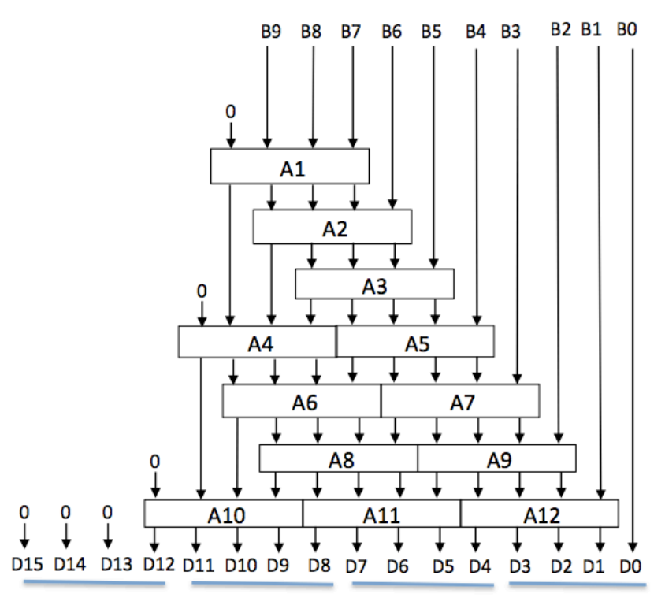

# Experiment 4 (optional): 10-bit switches to BCD

Similarly to the previous experiment, we needed to output a number on the 7-segment displays that corresponds to the binary value of the input switches. This time, we need to first convert them from hexadecial to binary-coded decimal as we will be displaying them in a more human-readable format!

Therefore, we created this 10-bit binary to BCD converter using the "shift and add 3" method shown in the digital electronics lectures.



```verilog
module bin2bcd10 (B, BCD_0, BCD_1, BCD_2, BCD_3);

	input [9:0] B;
	output [3:0] BCD_0, BCD_1, BCD_2, BCD_3;
	
	wire [3:0] w1, w2, w3, w4, w5, w6, w7, w8, w9, w10, w11, w12;
	wire [3:0] a1, a2, a3, a4, a5, a6, a7, a8, a9, a10, a11, a12;
	
	// instantiate the tree
	add3_ge5 A1 (w1, a1);
	add3_ge5 A2 (w2, a2);
	add3_ge5 A3 (w3, a3);
	add3_ge5 A4 (w4, a4);
	add3_ge5 A5 (w5, a5);
	add3_ge5 A6 (w6, a6);
	add3_ge5 A7 (w7, a7);
	add3_ge5 A8 (w8, a8);
	add3_ge5 A9 (w9, a9);
	add3_ge5 A10 (w10, a10);
	add3_ge5 A11 (w11, a11);
	add3_ge5 A12 (w12, a12);
	
	// wire the tree
	assign w1 = {1'b0, B[9:7]};
	assign w2 = {a1[2:0], B[6]};
	assign w3 = {a2[2:0], B[5]};
	assign w4 = {1'b0, a1[3], a2[3], a3[3]};
	assign w5 = {a3[2:0], B[4]};
	assign w6 = {a4[2:0], a5[3]};
	assign w7 = {a5[2:0], B[3]};
	assign w8 = {a6[2:0], a7[3]};
	assign w9 = {a7[2:0], B[2]};
	assign w10 = {1'b0, a4[3], a6[3], a8[3]};
	assign w11 = {a8[2:0], a9[3]};
	assign w12 = {a9[2:0], B[1]};
	
	// connect BCD digit out
	assign BCD_0 = {a12[2:0], B[0]};
	assign BCD_1 = {a11[2:0], a12[3]};
	assign BCD_2 = {a10[2:0], a11[3]};
	assign BCD_3 = {3'b0, a10[3]};

endmodule
```
(we also wrote our version of add3_ge5 for this purpose)
```verilog
module add3_ge5 (w, a);
	input [3:0] w;
	output [3:0] a;
	
	assign a = (w >= 5) ? w + 3 : w;
endmodule
```

### Implementing the bin2bcd module

The BCD version of ex4_top.v was very similar again to the previous one, but this time declaring additonal wires and feeding the inputs through the Binary>BCD converter before outputting the 7-segment display values.

```verilog
module ex4_top(SW, HEX0, HEX1, HEX2, HEX3);

	input [9:0] SW;
	output [6:0] HEX0;
	output [6:0] HEX1;
	output [6:0] HEX2;
	output [6:0] HEX3;

	wire [3:0] D0;
	wire [3:0] D1;
	wire [3:0] D2;
	wire [3:0] D3;

	bin2bcd10 BINBCD(SW, D0, D1, D2, D3);

	hex_to_7seg SEG0(HEX0, D0);
	hex_to_7seg SEG1(HEX1, D1);
	hex_to_7seg SEG2(HEX2, D2);
	hex_to_7seg SEG3(HEX3, D3);

endmodule
```

### Testing the 10-bit binary to BCD converter

We sent the design to the board to test it. It worked properly, and we recorded the following values for resource usage.

### Using a 16-bit bin2bcd converter

We then downloaded a 16-bit binary to BCD converter from the experiment website, and replaced the line in our top-level design with
```verilog
bin2bcd_16 BINBCD({6'b0, SW}, D0, D1, D2, D3);
```
This version worked in exactly the same way as the previous one, and furthermore the resources used were the same as the 10-bit version!

Quartus optimises the design to remove unused logic elements, which means it is much better to re-use more generic-purpose modules in multiple places rather than having many modules with different bit widths. This will reduce bugs, makes code more reusable, and does not have any impact on performance on the chip.
