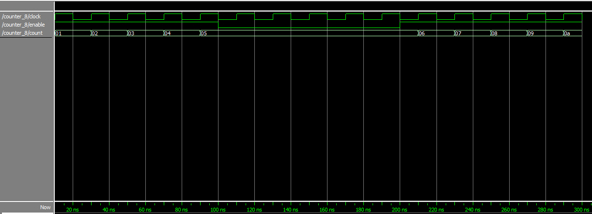

# Experiment 5: Designing and testing an 8-bit counter

We used the code provided in the lab booklet for an 8-bit counter module.

```verilog
`timescale 1ns/100ps

module counter_8(clock, enable, count);
	//DECLARE THE PORTS
	parameter BIT_SZ = 8;
	input clock;
	input enable;
	output [BIT_SZ-1:0] count;

	//count needs to be be declared as reg
	reg[BIT_SZ-1:0] count;

	//always initialise storage elements such as D-FF
	initial count = 0;

	always @ (posedge clock)
		if(enable == 1'b1)
			count <= count + 1'b1;

endmodule
```

### Simulating the binary counter

Instead of testing the counter on the DE1 board, which would require assigning pins and using the 7-segment displays, we can directly test the functionality of `counter_8` by running it through the ModelSim simulator.

We set up the testing environment using the following Tcl commands:

```
add wave clock enable
add wave -hexadecimal count
force clock 0 0, 1 10ns -repeat 20ns
force enable 1
run 100ns
force enable 0
run 100ns
force enable 1
run 100ns
```
This file acts as a primitive testbench to test our counter:
- Adds the waveforms to the graph
- Provides a clock input to the system
- **Asserts** the enable pin of the counter
- Runs the counter for 5 cycles
- **Deasserts** the enable pin of the counter
- Runs the counter for 5 cycles
- **Asserts** the enable pin of the counter
- Runs the counter for 5 cycles

We obtained the following waveform:



We can see that the module counted up from zero for 5 cycles, then remained on 5 while enable was `low`, and then counted up to 10 (0x0A in hex) in the remaining 5 cycles.

### Single-stepping through the code

As we repeated the simulation, single-stepping through the Verilog code, we could see the count being updated every time the line `count <= count + 1'b1` was called. In contrast, when enable was deasserted, execution would skip over that line when it reached the `if(enable == 1'b1)` statement.
