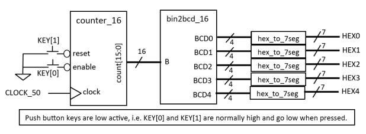

# Experiment 6: Implementing a 16-bit counter on the DE1

In this part of the labs, we modified *counter_8.v* to make it into a 16-bit counter and implemented it on to the DE1 through the 7-segment displays.

### Extending the 8-bit counter

In addition to changing the bit width of count from 8 to 16, we also added a *reset* pin that set the count to zero when asserted.
```verilog
module counter_16(clock, reset, enable, count);

	parameter BIT_SZ = 16;
	input clock;
	input reset;
	input enable;
	output reg [BIT_SZ-1:0] count;

	initial count = 0;

	always @ (posedge clock) begin
		if(enable == 1'b1)
			count = count + 1'b1;
		if(reset == 1'b1)
			count = 0;
	end

endmodule
```

### Specifying the top-level design

We then implemented *ex6_top.v* following this block diagram.



```verilog
module ex6_top(
CLOCK_50,
KEY,
HEX0,HEX1,HEX2,HEX3,HEX4);

	input CLOCK_50;
	input [1:0] KEY;
	output [6:0] HEX0;
	output [6:0] HEX1;
	output [6:0] HEX2;
	output [6:0] HEX3;
	output [6:0] HEX4;

	wire [15:0] count;
	
	wire [3:0] BCD_0;
	wire [3:0] BCD_1;
	wire [3:0] BCD_2;
	wire [3:0] BCD_3;
	wire [3:0] BCD_4;
	
	wire counter_en;
	wire clkout;
	
	clockdiv_50000 CLKDIV (CLOCK_50, clkout);
	
	assign counter_en = (~KEY[0]) & clkout;

	counter_16 CTR (CLOCK_50, ~KEY[1], counter_en, count[15:0]);
	
	bin2bcd_16 BCD (count[15:0], BCD_0[3:0], BCD_1[3:0], BCD_2[3:0], BCD_3[3:0], BCD_4[3:0]);
	
	hex_to_7seg H0 (HEX0[6:0], BCD_0[3:0]);
	hex_to_7seg H1 (HEX1[6:0], BCD_1[3:0]);
	hex_to_7seg H2 (HEX2[6:0], BCD_2[3:0]);
	hex_to_7seg H3 (HEX3[6:0], BCD_3[3:0]);
	hex_to_7seg H4 (HEX4[6:0], BCD_4[3:0]);

endmodule
```

### TimeQuest Analysis

After compiling and before testing on the board, we analysed certain parameters of the TimeQuest tool. Firstly, **Fmax Summary** for 0°C and 85°C temperatures.

#### Frequency

Model temperature | Maximum frequency
------------------|------------------
0 °C              | 422.12 MHz
85 °C             | 444.64 MHz

These results were puzzling: the maximum operating frequency of our circuit was higher at 85 degrees than it was at 0 degrees! It turns out that different components in a circuit have different temperature coefficients. While wires and resistors have positive temperature coefficients (their resistance increases with temperature), other elements may not. Evidently, our circuit included more components of the latter kind, resulting in maximum frequency going up with temperature.

#### Slack

We can also obtain setup and hold times from this analysis.

Model temperature | Setup slack | Hold slack
------------------|-------------|-----------
0 °C              | 14.099      | 0.369
85 °C             | 14.098      | 0.365

These values are fine as long as they are positive: if the slack goes negative, the design will not work on the FPGA!

#### Unconstrained paths

Finally, another piece of information that the analysis provides is about unconstrained paths. Quartus actually highlights this part in red, indicating that there is a problem. Indeed, the unconstrained paths summary shows:

Property                          |Setup| Hold
----------------------------------|-----|-----
Illegal Clocks                    | 0   | 0
Unconstrained Clocks              | 0   | 0
Unconstrained Input Ports         | 2   | 2
Unconstrained Input Port Paths    | 32  | 32
Unconstrained Output Ports        | 35  | 35
Unconstrained Output Port Paths   | 483 | 483

Having unconstrained paths means that some paths do not have timing constraints specified to them (e.g. not tied to a system clock). These do not break the design, but are sub-optimal. From Altera's website:
> Altera recommends that all paths and ports be constrained to achieve optimal placement and fitting results.

### Resources used

### Testing on the DE1

The design worked on the FPGA, after resolving some confusion with active-high and active-low signals.
