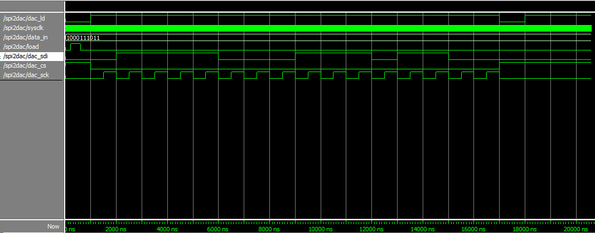

# Experiment 10: Interface with the DAC

The first experiment in part 4 of this lab introduced us to the MCP4911 Digital-to-Analog Converter, a chip located on the add-on card that converts a digital binary number into an analog signal.

### The DAC datasheet

#### Purpose of each pin

Pin | Description
--- | -----------
Vdd | Supply Voltage Input (2.7V to 5.5V)
CS  | Chip Select Input
SCK | Serial Clock Input
SDI | Serial Data Input
LDAC| Latch DAC Input. This pin is used to transfer the input register to the output register. Active low.
Vref| Voltage Reference Input
Vss | Ground
Vout| DAC Analog Output

#### The operation of SDI

The first four bits sent on SDI are configuration bits:
1. Write to DAC register if 0, otherwise ignore command
2. Buffered if set
3. Output Gain Selection bit (1x if 1, 2x if 0)
4. Output Shutdown Control bit (1 for active, 0 for shutdown)

The following 8 to 12 bits carry the digital data to be converted to analog.

### Timing diagram

The expected diagram for a 10-bit word with a value of 0x23B is as follows. First 4 configuration bits, then the data.

0x23B --> 0b1000111011

Cycle   | 1 | 2 | 3 | 4 | 5 | 6 | 7 | 8 | 9 |10 |11 |12 |13 |14
--------|---|---|---|---|---|---|---|---|---|---|---|---|---|---
**SDI** | 0 | 1 | 1 | 1 | 1 | 0 | 0 | 0 | 1 | 1 | 1 | 0 | 1 | 1

#### Simulation

