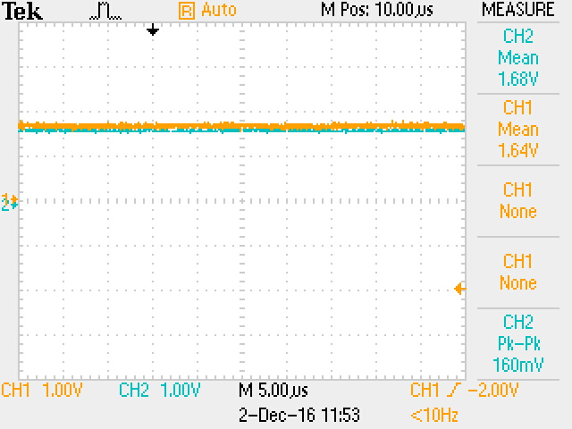

# Experiment 11: Pulse width modulation

PWM is an easier and cheaper method of obtaining an analog signal from digital data. We implemented a simple PWM module in Verilog. Given a certain 10-bit input data, the module adjusts the duty cycle of a 1024-clock-cycle square wave to match the data.

```verilog
module pwm(clk, data_in, load, pwm_out);
 
	input clk;
	input [9:0] data_in;
	input load;
	output pwm_out;
	
	reg [9:0] d;
	reg [9:0] count;
	reg pwm_out;
	
	always @(posedge clk)
		if (load == 1'b1) d <= data_in;
	
	initial count = 10'b0;
	
	always @(posedge clk) begin
		count <= count + 1;
		if (count > d)
			pwm_out <= 0;
		else
			pwm_out <= 1;
	end
 
endmodule
```

When we tested this design on the DE1, we found that once the PWM output was passed through the low-pass filter, it matched the output of the DAC chip almost perfectly.



The point of the low pass filter is to smoothen the fast-changing PWM waveform into a more averaged wave, which ends up being the analog value we are looking for.
