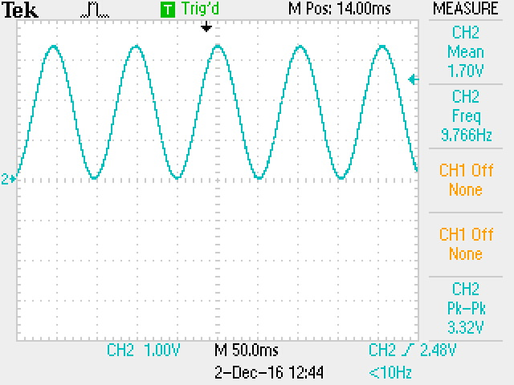

# Experiment 13: Fixed frequency sine wave generator

Instead of manually selecting values from the ROM using the input switches, as done in the previous experiment, we now connected the ROM address to a 10-bit counter. This way, the FPGA cycled through all 1024 values of a sine wave and outputted them through the digital-to-analog converters into the audio output.

```verilog
module ex13_top(CLOCK_50, DAC_CS, DAC_SDI, DAC_LD, DAC_SCK, PWM_OUT);

	input CLOCK_50;

	output DAC_CS;
	output DAC_SDI;
	output DAC_LD;
	output DAC_SCK;
	output PWM_OUT;

	wire [9:0] A;
	wire [9:0] D;
	wire clock_10k;

	clockdiv_5000 div5000 (CLOCK_50, clock_10k);

	counter_10 c_10(CLOCK_50, 1'b0, clock_10k, A);

	rom_10 rom(A, clock_10k, D);

	spi2dac(CLOCK_50, D, clock_10k, DAC_SDI, DAC_CS, DAC_SCK, DAC_LD);


endmodule
```
This code uses a modified version of the 16-bit counter from Experiment 6.

We measured the output of the DAC using an oscilloscope and saw a very pretty sine wave.



#### Mean voltage

The DAC can only output values between 0 V and 3.3 V. Therefore, it seems logical that this sine wave we are outputting is centred around 1.65 V, instead of around zero.

#### Frequency

The frequency of this wave is 9.76 Hz as measured by the oscilloscope.
- The counter advances at a frequency of 10 kHz
- There are 1024 values in the ROM table
- `10,000 / 1024 = 9.76`
