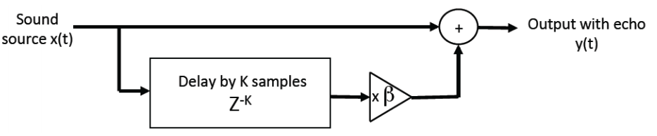

# Experiment 17: Echo synthesiser with single echo

The goal of this experiment was to create an echo synthesiser that would play sound with an added echo a fixed number of milliseconds later. Clearly, to do this we needed to store sound samples for a certain period of time and play them back at a reduced volume together with the sound input.

### Storing sound in a buffer

We implemented the sound buffer using the FIFO provided by Quartus. This module receives a sound sample every clock tick, stores it in RAM, and passes it along by one block per clock tick, much like a shift register. Once this buffer fills up, one sound sample is written into it and one sample is read out of it every cycle, except with a delay of 820 ms since it was put in (there are 8192 entries in our FIFO, samples taken at 10kHz, `t = 8192/10,000 s`).

### Building an echo

We then need to use this delayed sound sample to build the echo. To combine it with the currently incoming sound data, we can simply reduce its amplitude and add it to the sound input.



Addition is simple: `output = input + echo`. Reducing the amplitude proved to be more of a challenge. Instead of simply dividing the fifo output such as `echo = fifo_out / 2`, we needed to take into account issues with signed division. The safest way of solving this problem was to manually define the bits shifted, as `echo = {fifo_out[9], fifo_out[9:1]}`.

### Verilog code

```verilog
module processor (sysclk, data_in, data_out, data_valid, sw);

	input				sysclk;		// system clock
	input [9:0]		data_in;		// 10-bit input data
	output [9:0] 	data_out;	// 10-bit output data
	input				data_valid;	// data is valid?
	input	[9:0]		sw;

	wire				sysclk;
	wire [9:0]		data_in;
	reg [9:0] 		data_out;
	wire [9:0]		x, y;
	
	wire				fifo_full;
	wire	[9:0]		fifo_out;
	wire				valid_pulse;
	reg				valid_delayed;

	parameter 		ADC_OFFSET = 10'h181;
	parameter 		DAC_OFFSET = 10'h200;

	// decode input
	assign x = data_in[9:0] - ADC_OFFSET;

	// processor
	// ---------

	pulse_gen VALID_PULSER (valid_pulse, data_valid, sysclk);

	always @(posedge sysclk) begin
		valid_delayed <= valid_pulse;
	end

	fifo BUFFER (sysclk, x, fifo_full & valid_delayed, valid_pulse, fifo_full, fifo_out);

	assign y = x + {fifo_out[9], fifo_out[9:1]};

	// --------

	// encode output
	always @(posedge sysclk)
		data_out <=  y + DAC_OFFSET;

endmodule
```
