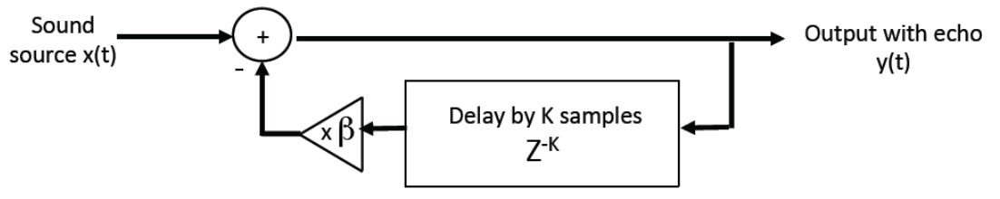

# Experiment 18: Multiple echoes

Although we proved that we could make an echo in experiment 17, a single echo does not sound very realistic. It is better to have multiple echoes, ever-decreasing in volume, following the original sound.

It turns out this is incredibly simple to implement, without requiring any extra logic, by feeding the output of the echo back into the FIFO instead of storing only the original sound.



### Translated into Verilog

There are two simple changes to the code from experiment 17:

1. The echo output is fed back into the FIFO instead of directly sampling audio input
2. The echo is constructed by subtracting the echo from the audio sample

```verilog
module processor (sysclk, data_in, data_out, data_valid, sw);

	input				sysclk;		// system clock
	input [9:0]		data_in;		// 10-bit input data
	output [9:0] 	data_out;	// 10-bit output data
	input				data_valid;	// data is valid?
	input	[9:0]		sw;

	wire				sysclk;
	wire [9:0]		data_in;
	reg [9:0] 		data_out;
	wire [9:0]		x, y;
	
	wire				fifo_full;
	wire	[9:0]		fifo_out;
	wire				valid_pulse;
	reg				valid_delayed;

	parameter 		ADC_OFFSET = 10'h181;
	parameter 		DAC_OFFSET = 10'h200;

	// decode input
	assign x = data_in[9:0] - ADC_OFFSET;

	// processor
	// ---------

	pulse_gen VALID_PULSER (valid_pulse, data_valid, sysclk);

	always @(posedge sysclk) begin
		valid_delayed <= valid_pulse;
	end

	fifo BUFFER (sysclk, y, fifo_full & valid_delayed, valid_pulse, fifo_full, fifo_out);

	assign y = x - {fifo_out[9], fifo_out[9:1]};

	// --------

	// encode output
	always @(posedge sysclk)
		data_out <=  y + DAC_OFFSET;

endmodule
```

### Why subtract?

We should note that the effect of a subtraction with a sine wave is simply a phase shift of 180°, thereby not fundamentally changing the sound. However, by subtracting instead of adding, we obtain destructive interference and therefore do not risk overflowing the 10-bit value for encoding the sound.
